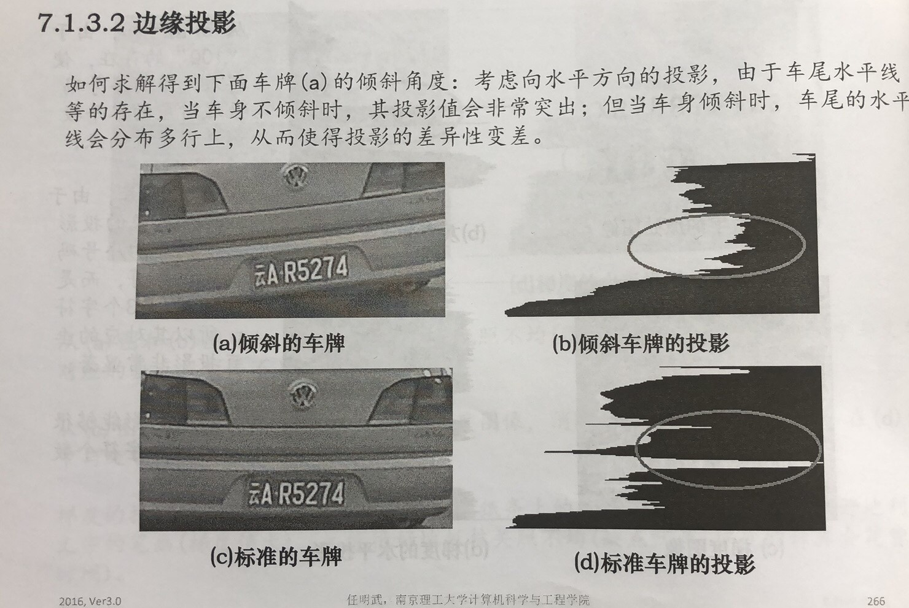
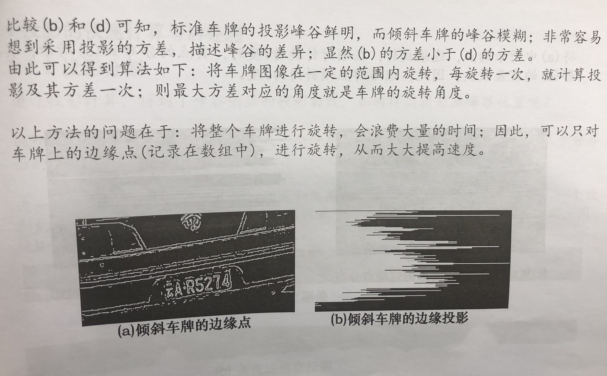
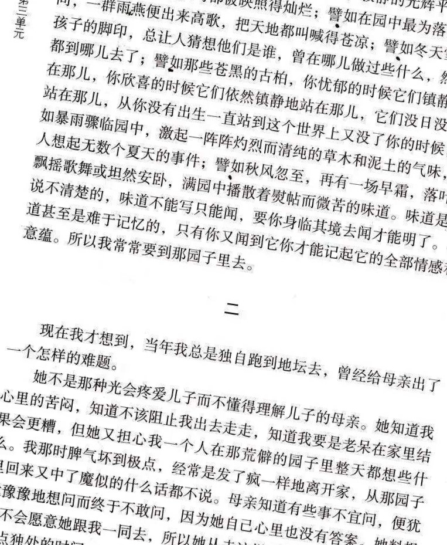
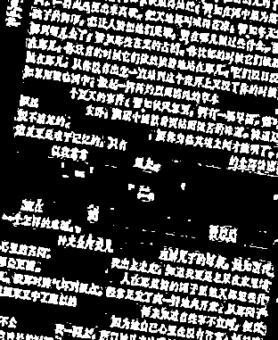
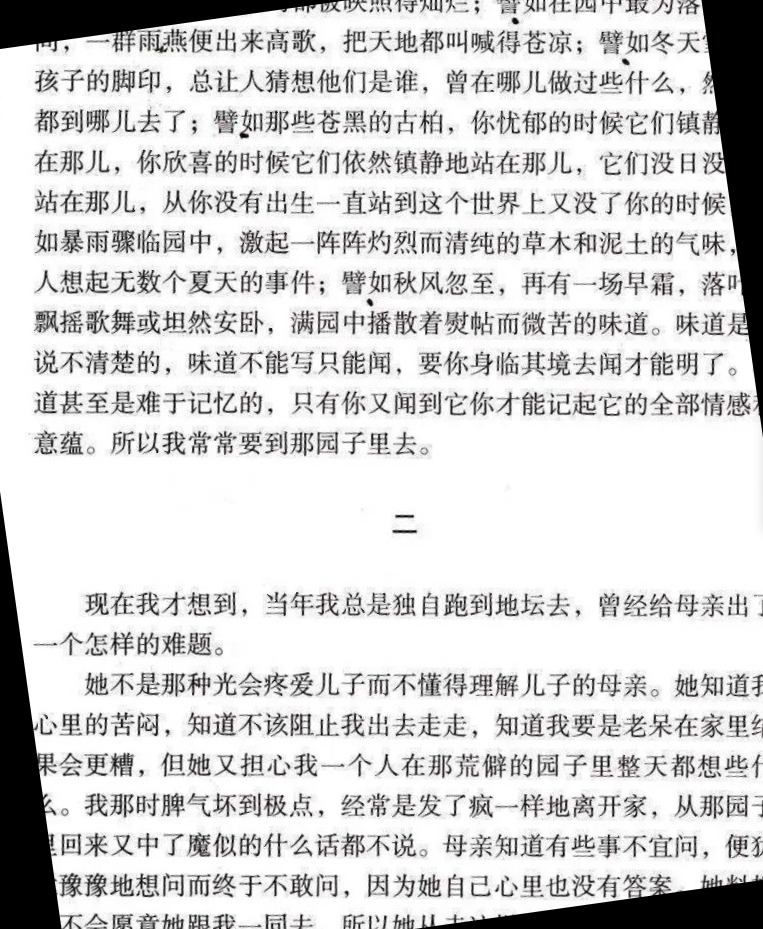

# detet-image-rotate-angle-
Find rotate angle of a text-contained image
 
Method: angle traversal with edge point projection

OCR任务中，有些图片具有小角度的倾斜（±45°以内），导致传入后续识别分类的模型时产生误差。

一种解决方法是，利用文本图像具有行间空白的特性，对待检测图像进行角度旋转遍历，并同时进行水平方向像素值投影，当文本方向水平时，投影所得的0值最多。

这个思路来自于读研时图像分析基础课所学的内容，原理如图所示：

在实际工程中，图像的质量得不到保证，需要对图像进行灰度化、高斯模糊、直方图均衡化、去噪声等操作，并且要删除图像中较长的线条，特别是避免竖直方向线条对像素值累加的干扰。

下图是用来测试的图像：

经过一系列操作提取边缘点：

判断为-8度 纠正之后：

为了加速计算，在遍历旋转角度时没有对整张图像进行旋转，而是计算旋转矩阵，然后对保存的若干个特征点（经过处理后图像中的非零点）进行计算。
